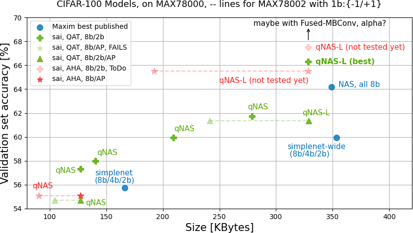

# Experiments on binary neural networks in computer vision by HyperbeeAI

Copyrights © 2023 Hyperbee.AI Inc. All rights reserved. hello@hyperbee.ai

This repository contains our experiments for quantized and binary neural networks for computer vision tasks, evaluated over the CIFAR100 benchmark dataset.

See checkpoints/ and associated evaluation scripts. See documentation/ for more information on results:

